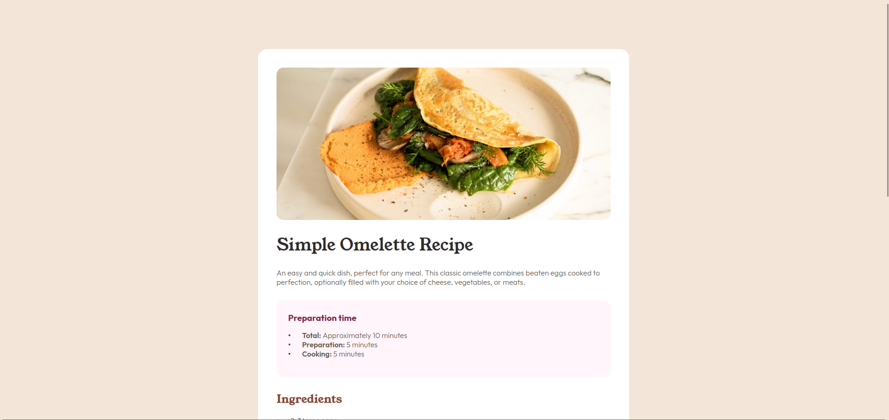

# Frontend Mentor - Recipe page solution

This is a solution to the [Recipe page challenge on Frontend Mentor](https://www.frontendmentor.io/challenges/recipe-page-KiTsR8QQKm)

### Screenshot

### Links

- Solution URL: [Solution](https://www.frontendmentor.io/solutions/receipt-page-using-semantic-html-and-css-with-adaptive-size-rVTKuezQ_J)
- Live Site URL: [GitHub Pages](https://lowkkid.github.io/recipe-page/)
